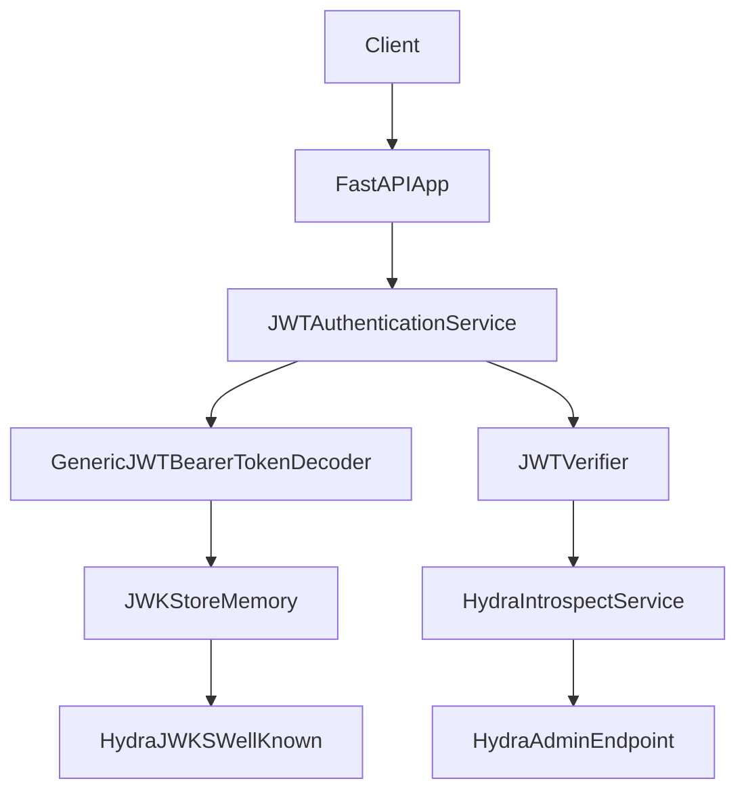

# JWT Authentication

Pluggable JWT Bearer authentication with JWKS-based key resolution, configurable extraction strategies, and clear HTTP status mapping for failures.

## When to use

- Validating JWT Bearer tokens in API endpoints.
- Implementing local JWT verification (alternative to introspection).
- Managing JWKS (JSON Web Key Set) for signature verification.
- Supporting multiple bearer locations (`Authorization` header, custom header, cookie).
- Building custom verifiers (scopes, audience, ext claims).
- Integrating with OAuth2 / OIDC flows (e.g. tokens issued by Hydra).

## Module entry points

```python
from fastapi_factory_utilities.core.security.jwt import (
    JWTAuthenticationServiceAbstract,
    JWTBearerAuthenticationConfig,
    JWTBearerAuthenticationConfigBuilder,
    DependsJWTBearerAuthenticationConfig,
    GenericJWTBearerTokenDecoder,
    JWTPayload,
    JWKStoreAbstract,
    JWKStoreMemory,
    JWTVerifierAbstract,
    JWTNoneVerifier,
    ExpiredJWTError,
    InvalidJWTError,
    InvalidJWTPayploadError,
    MissingJWTCredentialsError,
    NotVerifiedJWTError,
    configure_jwks_in_memory_store_from_hydra_introspect_services,
)
```

## JWTAuthenticationServiceAbstract

Orchestrates the per-request authentication flow.

```python
class JWTAuthenticationServiceAbstract(AuthenticationAbstract, Generic[Payload]):
    def __init__(
        self,
        identifier: str,
        jwt_bearer_authentication_config: JWTBearerAuthenticationConfig,
        jwt_verifier: JWTVerifierAbstract[Payload],
        jwt_decoder: JWTBearerTokenDecoderAbstract[Payload],
        raise_exception: bool = True,
    ) -> None: ...

    async def authenticate(self, request: Request) -> None: ...
```

`authenticate(request)`:

1. Calls `extract_token_from_request(...)` (see [Bearer extraction strategies](#bearer-extraction-strategies)). Failure → `HTTPException(401)`.
2. Decodes the JWT via `jwt_decoder.decode_payload(...)`. Failure → `HTTPException(403)` (invalid token / payload).
3. Calls `jwt_verifier.verify(...)`. Failure → `HTTPException(403)`.
4. On success, `self.payload` exposes the decoded payload.

With `raise_exception=False` the service records errors instead of raising; check `has_errors()` and `payload` after `authenticate()`. This mode pairs with the Velmios resolver which collects errors from multiple parallel mechanisms.

`ExpiredJWTError` (subclass of `InvalidJWTError`) is raised by PyJWT when `exp` is in the past; downstream services treat it like any other invalid token and the service maps it to HTTP 403. Invalid-credential paths are logged at DEBUG level so legitimate failures (e.g. someone hitting a public endpoint without auth) do not flood error logs.

## JWTBearerAuthenticationConfig

Frozen Pydantic config validated on instantiation.

```python
class JWTBearerAuthenticationConfig(BaseModel):
    model_config = ConfigDict(frozen=True, extra="forbid")

    authorized_algorithms: list[str] = Field(default_factory=lambda: list(get_default_algorithms().keys()))
    authorized_audiences: list[str] | None = None
    issuer: OAuth2Issuer
    audience: str | None = None

    authorized_locations: list[JWTLocation] = Field(default_factory=lambda: [JWTLocation.AUTHORIZATION_BEARER])
    header_name: str | None = None
    cookie_name: str | None = None
```

- `authorized_algorithms` MUST be in PyJWT's `requires_cryptography` set; e.g. `["RS256"]`.
- `authorized_audiences` accepts a comma-separated string or list; trimmed and deduplicated.
- `audience` lives on the config (moved out of `BaseApplicationConfig` in FFU v0.19.2) and is used as the default audience for signing/verifying.
- `authorized_locations` selects extraction strategies; combine `HEADER`, `AUTHORIZATION_BEARER`, and `COOKIE` as needed (custom `header_name` / `cookie_name` required for those locations).

`JWTBearerAuthenticationConfigBuilder(key=...)` loads a config from `application.yaml` under `jwt_configs.{key}`. `DependsJWTBearerAuthenticationConfig.import_to_state(state, config, key=...)` stores the config on `app.state` so dependencies can fetch the right key per route stack (Velmios uses `"internal"` and `"customer"`).

## Bearer extraction strategies

`extract_token_from_request(...)` iterates `authorized_locations` in order:

| Location | Strategy class | Notes |
|---|---|---|
| `AUTHORIZATION_BEARER` | `JWTBearerTokenExtractionStrategyHeaderAuthorizationBearer` | Standard `Authorization: Bearer <token>` header. |
| `HEADER` | `JWTHeaderTokenExtractionStrategy` | Custom header name (e.g. `X-Auth-Token`). |
| `COOKIE` | `JWTBearerTokenExtractionStrategyCookie` | Bearer token stored in a cookie. |

Iteration rules:

- `MissingJWTCredentialsError` from a strategy is suppressed and the next strategy is tried.
- `InvalidJWTError` is remembered; if no other strategy succeeds, the last invalid error is re-raised.
- If every strategy reports "missing", a final `MissingJWTCredentialsError("Missing Credentials")` is raised.

Helper classmethods `extract_authorization_header_from_request(request)` and `extract_bearer_token_from_authorization_header(header)` are still available for ad-hoc parsing.

## GenericJWTBearerTokenDecoder

```python
decoder = GenericJWTBearerTokenDecoder[JWTPayload](
    jwt_bearer_authentication_config=config,
    jwks_store=jwks_store,
)

payload = await decoder.decode_payload(jwt_token=token)
```

Flow:

1. Extract `kid` from the JWT header (unverified read).
2. `jwks_store.get_jwk(kid)` returns the `PyJWK` to verify with.
3. PyJWT validates signature, issuer, audience(s), and expiration.
4. The decoded dict is validated against `JWTPayload` (or a subclass).

Standalone helper:

```python
from fastapi_factory_utilities.core.security.jwt.decoders import decode_jwt_token_payload

raw_payload = await decode_jwt_token_payload(
    jwt_token=token,
    public_key=jwk,
    jwt_bearer_authentication_config=config,
    subject=None,
)
```

## JWKS stores

```python
class JWKStoreAbstract(ABC):
    async def get_jwk(self, kid: str) -> PyJWK: ...
    async def get_issuer_by_kid(self, kid: str) -> OAuth2Issuer: ...
    async def get_jwks(self, issuer: OAuth2Issuer) -> PyJWKSet: ...
    async def add_jwk(self, issuer: OAuth2Issuer, jwk: PyJWK) -> None: ...
```

`JWKStoreMemory` is the concurrency-safe in-memory implementation. Populate it from one or several Hydra introspection services:

```python
store = await configure_jwks_in_memory_store_from_hydra_introspect_services(
    introspect_service_list=[internal_hydra_service, customer_hydra_service],
)
```

This is what Velmios `configure_velmios_jwks_store_memory` calls under the hood to keep internal and customer JWKS in one store.

## JWTPayload

Frozen Pydantic model. All fields required.

| Field | Type | Notes |
|---|---|---|
| `scp` | `list[str]` | OAuth2 scopes (space-separated string or list, normalized to lowercase). |
| `aud` | `list[str]` | Audience list (same normalization). |
| `iss` | `str` | Issuer. |
| `exp` | `datetime` | UTC; accepts Unix timestamps. |
| `iat` | `datetime` | UTC. |
| `nbf` | `datetime` | UTC. |
| `sub` | `str` | Subject. |

Subclass to add custom claims (e.g. Velmios `VelmiosCustomerJWTPayload` adds a discriminated `ext` union, `VelmiosInternalJWTPayload` adds `metadata: dict`).

## Custom verifiers

```python
class ScopeVerifier(JWTVerifierAbstract[JWTPayload]):
    def __init__(self, required_scope: str) -> None:
        self._required_scope = required_scope

    async def verify(self, jwt_token: JWTToken, jwt_payload: JWTPayload) -> None:
        if self._required_scope not in jwt_payload.scp:
            raise NotVerifiedJWTError(message=f"Missing required scope: {self._required_scope}")
```

`JWTNoneVerifier` is the no-op verifier (only signature and standard claims have been validated).

## Error handling

| Exception | When | HTTP |
|---|---|---|
| `MissingJWTCredentialsError` | No bearer token found by any strategy | **401** |
| `InvalidJWTError` (incl. `ExpiredJWTError`) | Bad header format, missing `kid`, PyJWT decode failure, expired token | **403** |
| `InvalidJWTPayploadError` | Pydantic payload validation failure | **403** |
| `NotVerifiedJWTError` | Custom verifier rejects the token | **403** |

The 401 vs 403 split (v5.0.1) gives downstream observability a clean signal: 401 means "no credentials", 403 means "credentials present but rejected".

## End-to-end Hydra + JWT flow


```mermaid
flowchart TD
  client[Client] --> api[FastAPIApp]
  api --> jwtService[JWTAuthenticationService]
  jwtService --> decoder[GenericJWTBearerTokenDecoder]
  jwtService --> verifier[JWTVerifier]
  decoder --> jwkStore[JWKStoreMemory]
  verifier --> hydraIntrospect[HydraIntrospectService]
  hydraIntrospect --> hydraAdmin[HydraAdminEndpoint]
  jwkStore --> hydraPublic[HydraJWKSWellKnown]
```

- JWKS setup: `configure_jwks_in_memory_store_from_hydra_introspect_services(...)` or `HydraIntrospectService.get_wellknown_jwks()` populates `JWKStoreMemory`.
- Local validation: `GenericJWTBearerTokenDecoder` plus `JWTBearerAuthenticationConfig` verify signature, issuer, audiences, and expiration.
- Optional introspection: a verifier can call Hydra's introspection endpoint to enforce that the token is still active.

## Best practices

1. Populate the JWKS store from the trusted Hydra well-known endpoint; refresh periodically in production.
2. Use only asymmetric algorithms (e.g. `RS256`) for Bearer tokens; never `none` or HMAC.
3. Always set `authorized_audiences` and `issuer`.
4. Layer custom verifiers for scopes and claim checks; keep the decoder free of business logic.
5. Inject the config through `DependsJWTBearerAuthenticationConfig(key=...)` so per-route stacks can target different issuers (internal vs customer).
6. Map `ExpiredJWTError` to 403 deliberately — clients that expect 401 must refresh on either status code.

## Reference

- `src/fastapi_factory_utilities/core/security/jwt/services.py`
- `src/fastapi_factory_utilities/core/security/jwt/decoders.py`
- `src/fastapi_factory_utilities/core/security/jwt/extraction_strategies.py`
- `src/fastapi_factory_utilities/core/security/jwt/stores.py`
- `src/fastapi_factory_utilities/core/security/jwt/configs.py`
- `src/fastapi_factory_utilities/core/security/jwt/objects.py`
- `src/fastapi_factory_utilities/core/security/jwt/verifiers.py`
- `src/fastapi_factory_utilities/core/security/jwt/exceptions.py`
