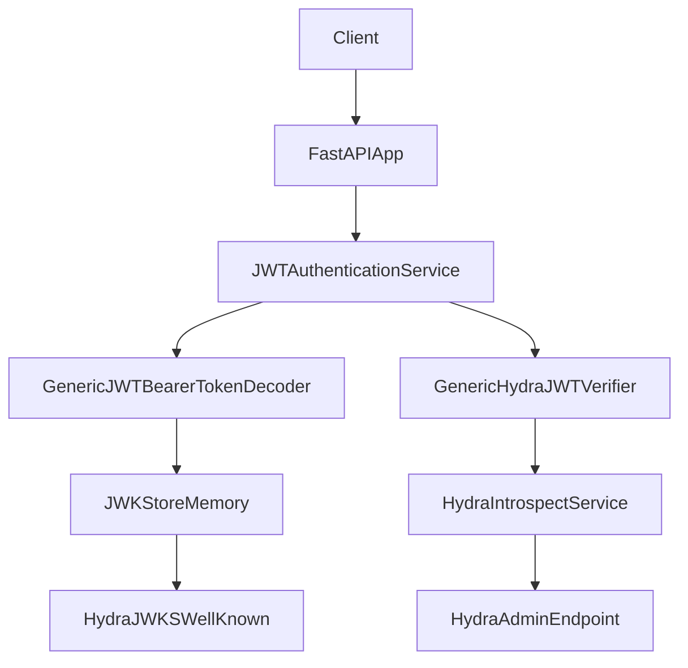

# JWT Authentication

The JWT authentication module provides Bearer token validation with JWKS-based key resolution, pluggable decoders and verifiers, and integration with FastAPI's `AuthenticationAbstract`.

## When to Use

Use JWT authentication when:
- Validating JWT Bearer tokens in API endpoints
- Implementing local JWT verification (as an alternative to token introspection)
- Managing JWKS (JSON Web Key Set) for signature verification
- Building custom JWT verification logic beyond signature validation
- Integrating with OAuth2/OIDC token flows (e.g., tokens issued by Hydra)

## JWTAuthenticationServiceAbstract

Generic service class that orchestrates JWT Bearer authentication. Extends `AuthenticationAbstract` and is intended to be used either directly (with a configured decoder and verifier) or as a base class for your own typed service.

### Basic Usage

```python
from fastapi import APIRouter, Depends, Request
from fastapi_factory_utilities.core.security.jwt import (
    GenericJWTBearerTokenDecoder,
    JWTAuthenticationServiceAbstract,
    JWTBearerAuthenticationConfig,
    JWTNoneVerifier,
    JWTPayload,
    JWKStoreMemory,
)

router = APIRouter()

# Configuration used by both Hydra services and local JWT verification
config = JWTBearerAuthenticationConfig(
    authorized_algorithms=["RS256"],
    authorized_audiences=["my-api"],
    issuer="https://auth.example.com",
)

# JWK store populated from Hydra JWKS (see Hydra docs)
jwks_store = JWKStoreMemory()
# Example: keys added up-front from Hydra JWKS
# for jwk in hydra_jwks:
#     await jwks_store.add_jwk(issuer=config.issuer, jwk=jwk)

decoder = GenericJWTBearerTokenDecoder[JWTPayload](
    jwt_bearer_authentication_config=config,
    jwks_store=jwks_store,
)
verifier = JWTNoneVerifier()

auth_service = JWTAuthenticationServiceAbstract[JWTPayload](
    identifier="jwt_auth",
    jwt_bearer_authentication_config=config,
    jwt_verifier=verifier,
    jwt_decoder=decoder,
    raise_exception=True,
)


@router.get("/protected")
async def protected_route(
    request: Request,
    _: None = Depends(auth_service.authenticate),
):
    payload = auth_service.payload
    return {"sub": payload.sub, "scp": payload.scp}
```

### Extract Token from Request

```python
from fastapi_factory_utilities.core.security.jwt import JWTAuthenticationServiceAbstract

# Class methods for manual extraction (available on the abstract service)
auth_header = JWTAuthenticationServiceAbstract.extract_authorization_header_from_request(request)
token = JWTAuthenticationServiceAbstract.extract_bearer_token_from_authorization_header(auth_header)
```

### Custom Payload Type

Use the abstract service with a custom payload model:

```python
from fastapi_factory_utilities.core.security.jwt import (
    JWTAuthenticationServiceAbstract,
    JWTPayload,
    GenericJWTBearerTokenDecoder,
    JWTVerifierAbstract,
)

class CustomPayload(JWTPayload):
    custom_claim: str

class CustomVerifier(JWTVerifierAbstract[CustomPayload]):
    async def verify(self, jwt_token, jwt_payload: CustomPayload) -> None:
        if not jwt_payload.custom_claim:
            raise NotVerifiedJWTError("Missing custom claim")

decoder = GenericJWTBearerTokenDecoder[CustomPayload](
    jwt_bearer_authentication_config=config,
    jwks_store=jwks_store,
)

service = JWTAuthenticationServiceAbstract[CustomPayload](
    identifier="custom_jwt_auth",
    jwt_bearer_authentication_config=config,
    jwt_verifier=CustomVerifier(),
    jwt_decoder=decoder,
)
```

## GenericJWTBearerTokenDecoder

Decodes JWT using `kid` from the header and keys from a JWKS store.

### Flow

1. Extract `kid` from JWT header (unverified)
2. Retrieve JWK from store via `get_jwk(kid)`
3. Decode with PyJWT (signature, issuer, audience validated)
4. Validate decoded dict against `JWTPayload` (or custom payload model)

### Usage

```python
from fastapi_factory_utilities.core.security.jwt import (
    GenericJWTBearerTokenDecoder,
    JWTBearerAuthenticationConfig,
    JWKStoreAbstract,
    JWTPayload,
)

decoder = GenericJWTBearerTokenDecoder[JWTPayload](
    jwt_bearer_authentication_config=config,
    jwks_store=jwks_store,
)
payload = await decoder.decode_payload(jwt_token=token)
```

### Standalone Decode Helper

```python
from fastapi_factory_utilities.core.security.jwt.decoders import (
    decode_jwt_token_payload,
)
from jwt.api_jwk import PyJWK

raw_payload = await decode_jwt_token_payload(
    jwt_token=token,
    public_key=jwk,
    jwt_bearer_authentication_config=config,
    subject=None,  # Optional subject check
    # issuer can be overridden; defaults to config.issuer if not provided
    # issuer=OAuth2Issuer("https://auth.example.com"),
)
```

## JWKStoreAbstract / JWKStoreMemory

Abstract store for JWKS; concrete in-memory implementation is concurrency-safe.

### JWKStoreAbstract

- `get_jwk(kid: str) -> PyJWK` - Get key by ID.
- `get_issuer_by_kid(kid: str) -> OAuth2Issuer` - Get issuer associated with a given key ID.
- `get_jwks(issuer: OAuth2Issuer) -> PyJWKSet` - Get full key set for a given issuer.
- `add_jwk(issuer: OAuth2Issuer, jwk: PyJWK) -> None` - Store or update a single key for an issuer.

### JWKStoreMemory

```python
from fastapi_factory_utilities.core.security.jwt import (
    JWKStoreMemory,
    configure_jwks_in_memory_store_from_hydra_introspect_services,
)
from fastapi_factory_utilities.core.services.hydra import HydraIntrospectService

# Option 1: Build from Hydra introspect services (recommended)
store = await configure_jwks_in_memory_store_from_hydra_introspect_services(
    introspect_service_list=[hydra_introspect_service],
)

# Option 2: Manually add keys
store = JWKStoreMemory()
for jwk in hydra_jwks:
    await store.add_jwk(issuer=config.issuer, jwk=jwk)

jwk = await store.get_jwk(kid="my-key-id")
jwks = await store.get_jwks(issuer=config.issuer)
```

Use with [Hydra Service](hydra-service.md) to obtain JWKS: `await hydra_service.get_wellknown_jwks()` and then add each key to the store or use the helper to configure the store automatically.

## JWTPayload

Pydantic model for decoded JWT payload (frozen, extra ignored). All fields are required.

| Field | Type | Description |
|-------|------|-------------|
| `scp` | list[str] | OAuth2 scopes (space-separated string or list, normalized to lowercase) |
| `aud` | list[str] | Audiences (same normalization) |
| `iss` | str | Issuer |
| `exp` | datetime | Expiration (UTC; accepts Unix timestamp or datetime) |
| `iat` | datetime | Issued at (UTC) |
| `nbf` | datetime | Not before (UTC) |
| `sub` | str | Subject |

Custom payload models should subclass `JWTPayload` and add optional or required fields.

## Configuration

### JWTBearerAuthenticationConfig

Frozen Pydantic config for JWT validation.

```python
from fastapi_factory_utilities.core.security.jwt import JWTBearerAuthenticationConfig

config = JWTBearerAuthenticationConfig(
    authorized_algorithms=["RS256"],  # Must all be in PyJWT's requires_cryptography set
    authorized_audiences=["api://default", "my-audience"],  # Or "aud1,aud2"
    issuer="https://hydra.example.com",
)
```

- **authorized_algorithms**: List of algorithms; any algorithm not in PyJWT's `requires_cryptography` set raises `ValueError`.
- **authorized_audiences**: Optional. Comma-separated string or list; cleaned (trimmed, empties removed) and deduplicated; empty after processing raises `ValueError`.
- **issuer**: Required `OAuth2Issuer` used as default issuer during decoding.

Validation: invalid algorithms or an empty processed audience list raise `ValueError`.

## Custom Verifiers

Implement `JWTVerifierAbstract` to add checks after decoding (e.g., scope or custom claims).

```python
from fastapi_factory_utilities.core.security.jwt import (
    JWTVerifierAbstract,
    JWTPayload,
    JWTToken,
    NotVerifiedJWTError,
)

class ScopeVerifier(JWTVerifierAbstract[JWTPayload]):
    def __init__(self, required_scope: str) -> None:
        self._required_scope = required_scope

    async def verify(self, jwt_token: JWTToken, jwt_payload: JWTPayload) -> None:
        if self._required_scope not in jwt_payload.scp:
            raise NotVerifiedJWTError(
                message=f"Missing required scope: {self._required_scope}"
            )
```

`JWTNoneVerifier` is a no-op verifier (signature and claims are already validated by the decoder).

## Error Handling

Exceptions inherit from `JWTAuthenticationError` (and `FastAPIFactoryUtilitiesError`).

| Exception | When |
|-----------|------|
| `MissingJWTCredentialsError` | No `Authorization` header |
| `InvalidJWTError` | Invalid header format, missing `kid`, or PyJWT decode failure |
| `InvalidJWTPayploadError` | Payload fails Pydantic validation (e.g., missing required claims) |
| `NotVerifiedJWTError` | Custom verifier rejects the token |

### Example

```python
from fastapi import HTTPException
from http import HTTPStatus
from fastapi_factory_utilities.core.security.jwt.exceptions import (
    MissingJWTCredentialsError,
    InvalidJWTError,
    InvalidJWTPayploadError,
    NotVerifiedJWTError,
)

try:
    await auth_service.authenticate(request)
except (MissingJWTCredentialsError, InvalidJWTError):
    raise HTTPException(status_code=HTTPStatus.UNAUTHORIZED, detail="Invalid or missing credentials")
except (InvalidJWTPayploadError, NotVerifiedJWTError):
    raise HTTPException(status_code=HTTPStatus.FORBIDDEN, detail="Token not valid")
```

With `raise_exception=False`, the service appends exceptions to `auth_service._errors` instead of raising; check `auth_service.has_errors()` and `auth_service.payload` after `authenticate()`.

## Best Practices

1. **JWKS source**: Populate the JWKS store from a trusted source (e.g., Hydra's `.well-known/jwks.json`); see [Hydra Service](hydra-service.md).
2. **Algorithms**: Use only asymmetric algorithms (e.g., RS256) for API-held public keys; avoid `none` and symmetric algorithms for Bearer tokens.
3. **Audience and issuer**: Always set `authorized_audiences` and `issuer` in production.
4. **Verifiers**: Use custom verifiers for scope or claim checks; keep signature and standard claims in the decoder.
5. **Dependency injection**: Inject config and JWKS store (or decoder/verifier) via FastAPI `Depends` so keys and config can be refreshed or vary by environment.

## End-to-End Hydra + JWT Flow

At a high level, Hydra issues and introspects tokens, while the JWT module validates those tokens locally using JWKS obtained from Hydra.



- **JWKS setup**: `HydraIntrospectService.get_wellknown_jwks()` (or the helper `configure_jwks_in_memory_store_from_hydra_introspect_services`) populates `JWKStoreMemory`.
- **Local JWT validation**: `GenericJWTBearerTokenDecoder` uses the JWK store and `JWTBearerAuthenticationConfig` to verify signature, issuer, and audiences and to build a `JWTPayload`.
- **Optional introspection**: `GenericHydraJWTVerifier` can call Hydra’s introspection endpoint to enforce that the token is still active and meets additional requirements (scopes, audiences, etc.).

## Reference

- `src/fastapi_factory_utilities/core/security/abstracts.py` - AuthenticationAbstract
- `src/fastapi_factory_utilities/core/security/jwt/services.py` - JWTAuthenticationService
- `src/fastapi_factory_utilities/core/security/jwt/decoders.py` - JWTBearerTokenDecoder
- `src/fastapi_factory_utilities/core/security/jwt/stores.py` - JWKStoreAbstract, JWKStoreMemory
- `src/fastapi_factory_utilities/core/security/jwt/objects.py` - JWTPayload
- `src/fastapi_factory_utilities/core/security/jwt/configs.py` - JWTBearerAuthenticationConfig
- `src/fastapi_factory_utilities/core/security/jwt/verifiers.py` - JWTVerifierAbstract
- `src/fastapi_factory_utilities/core/security/jwt/exceptions.py` - JWT exceptions
