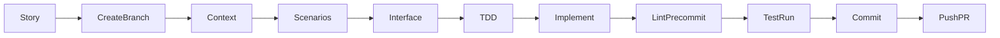

# Story-Driven Development

This skill defines a repeatable workflow for implementing features from a user story: take the story, work on a dedicated branch, gather context, define scenarios, design the endpoint interface, practice TDD, implement, run the quality gate (lint, pre-commit, tests), commit, and open a Pull Request on GitHub. Each phase references existing skills; this skill orchestrates them without duplicating content.

## When to Use

- Implementing a feature from a Jira story or user story.
- Creating a feature branch or opening a Pull Request on GitHub.
- User asks for story-to-code workflow, TDD workflow, or GitHub PR workflow.
- Trigger terms: user story, Jira, acceptance criteria, TDD, endpoint, OpenAPI, feature implementation, retrospective, Jira comments, PR summary.

## Overview

Work in this order: take the story → create a dedicated branch (from main or project default) → gather context → define expected scenarios → describe endpoint interface (OpenAPI) → TDD (tests first) → implement → lint and pre-commit → run tests → commit → push and open Pull Request. Release (CHANGELOG, version, tag) is a separate step after PR merge when cutting a release from main.

**Throughout (Jira):** When a Jira ticket exists, comment on the ticket for important decisions or issues encountered (e.g. design trade-offs, blockers, workarounds) so the team can use it in retrospectives. Use [jira-cli](../jira-cli/SKILL.md) to add comments (e.g. `jira issue comment add ISSUE-KEY "body"`). For creating or refining stories, use [jira-epics-stories](../jira-epics-stories/SKILL.md). If jira-cli is not available, document decisions and issues in the PR description or in a note for the user.

---

## Workflow

### Phase 1: Take the Story

**Objective:** Get the story title, "As a… I want… So that…", and acceptance criteria.

**Steps:**

1. Obtain the user story (from Jira, user message, or context). When the story is in Jira and a ticket key is provided, use [jira-cli](../jira-cli/SKILL.md) to fetch issue details (e.g. list or view by key). If creating or refining stories, use [jira-epics-stories](../jira-epics-stories/SKILL.md).
2. Extract or confirm: title, role/goal/benefit, and testable acceptance criteria.

**Exit condition:** Clear story and acceptance criteria in hand. Proceed to phase 2.

---

### Phase 2: Create Dedicated Branch

**Objective:** Create and checkout a branch for this story only. All work for the story happens on this branch.

**Steps:**

1. Ensure the integration branch (e.g. `main` or project default) is up to date.
2. Create and checkout a new branch from that integration branch. Name it per [git](../git/SKILL.md) convention: `TICKET/type/short-name` (e.g. `TIC-001/feat/orders-filter`).

**IMPORTANT:** All work for the story happens on this branch. Do not mix multiple stories on one branch.

**Exit condition:** On the dedicated branch. Proceed to phase 3.

---

### Phase 3: Gather Context

**Objective:** Understand domain, existing APIs, codebase layout, and dependencies.

**Steps:**

1. Search project docs and codebase for relevant domain, existing endpoints, and patterns.
2. Apply [software-architecture](../software-architecture/SKILL.md) and [python-architecture](../python-architecture/SKILL.md) as needed for boundaries and service structure.

**Exit condition:** Enough context to define scenarios and the endpoint. Proceed to phase 4.

---

### Phase 4: Define Expected Scenarios

**Objective:** Turn acceptance criteria into testable Given/When/Then scenarios; include success and key failure paths.

**Steps:**

1. For each acceptance criterion, derive one or more scenarios (Given context, When action, Then observable result).
2. Cover success cases and important failure/edge cases (e.g. validation errors, not found).

Scenarios **MUST** be defined before writing production code. No dedicated skill; use inline guidance. Optional: add a reference file (e.g. references/scenario-definition.md) for detailed Given/When/Then examples (API success/4xx/5xx) and link from this phase if the main body grows.

**Exit condition:** Scenarios written and agreed. Proceed to phase 5.

---

### Phase 5: Describe Endpoint Interface

**Objective:** Design the request/response and HTTP contract before coding.

**Steps:**

1. Design the endpoint(s) using [http-api-architecture](../http-api-architecture/SKILL.md) (resource naming, methods, status codes).
2. Add or update the OpenAPI spec using [openapi](../openapi/SKILL.md) (paths, schemas, examples).

**IMPORTANT:** Do not skip interface design. The spec is the contract for implementation and tests.

**Exit condition:** OpenAPI (or equivalent) updated. Proceed to phase 6.

---

### Phase 6: TDD — Tests First

**Objective:** Write failing tests from the scenarios, then implement until green.

**Steps:**

1. Write failing tests that express the scenarios. Use [python-test](../python-test/SKILL.md) (unit and integration patterns).
2. Implement the minimum code to make tests pass (red → green → refactor).

**Exit condition:** Tests green and behavior matches scenarios. Proceed to phase 7.

---

### Phase 7: Implement

**Objective:** Implement behavior to satisfy tests and the endpoint contract.

**Steps:**

1. Follow [python-architecture](../python-architecture/SKILL.md), [python](../python/SKILL.md), and [python-docstring](../python-docstring/SKILL.md). Use [fastapi-factory-utilities](../fastapi-factory-utilities/SKILL.md) if building a FastAPI service.
2. Ensure implementation matches the OpenAPI spec and all tests pass.

**Exit condition:** Feature implemented and tests green. Proceed to phase 8.

---

### Phase 8: Lint and Pre-commit

**Objective:** Run linter and pre-commit; fix all issues before committing.

**Steps:**

1. Run the project linter (e.g. `scripts/lint-code.sh` or Ruff, Pylint, Mypy per [python-lint](../python-lint/SKILL.md)). Use [python](../python/SKILL.md) scripts if present.
2. Run pre-commit: `pre-commit run --all-files` (and commitlint per [git](../git/SKILL.md)).
3. Fix any reported issues and repeat until clean.

**Exit condition:** Lint and pre-commit pass. Proceed to phase 9.

---

### Phase 9: Run Tests

**Objective:** Run the full test suite; only proceed when tests pass. Optionally run API contract tests when the feature changes the API.

**Steps:**

1. Run the test suite (e.g. `scripts/run-tests.sh` or `pytest`). Use [python-test](../python-test/SKILL.md).
2. If the feature adds or changes API surface, run [openapi-testing](../openapi-testing/SKILL.md) (Portman/Newman) for contract tests when applicable.
3. Fix any failures before committing.

**IMPORTANT:** Do not commit until the test run is green. Treat the test run as a gate.

**Exit condition:** All relevant tests pass. Proceed to phase 10.

---

### Phase 10: Commit

**Objective:** Commit on the dedicated branch with a conventional message (and JIRA ticket if applicable).

**Steps:**

1. Stage changes and commit using [git](../git/SKILL.md): Conventional Commits format, optional JIRA ticket in the message (e.g. `[TIC-001] feat(api): add orders filtering`).

**Exit condition:** Changes committed on the story branch. Proceed to phase 11.

---

### Phase 11: Push and Open Pull Request

**Objective:** Push the branch to the remote and open a Pull Request on GitHub with a description that includes a summary of changes and key points. Link to the story.

**Steps:**

1. Push the branch: `git push -u origin <branch-name>` (see [git](../git/SKILL.md)).
2. Open a Pull Request on GitHub targeting the integration branch (e.g. `main`). In the PR:
   - **Title:** Clear, concise (e.g. feat(api): add orders filtering).
   - **Description:** **MUST** include a **summary** of what was done and key points. Example: "Summary: Added GET /orders with query filters (status, date range); fixed pagination edge case when total is zero." Add a link to the Jira story (or user story).

**NOTE:** Release (CHANGELOG, version bump, tag) is a separate step **after** the PR is merged, when cutting a release from main. Do not treat opening the PR as the release step.

**Exit condition:** PR opened with summary in description and link to story.

---

## Skills Reference

| Phase | Skill(s) / references |
|-------|------------------------|
| 1 | jira-cli (fetch issue by key); jira-epics-stories (if creating/refining); otherwise story as input |
| Throughout | jira-cli (comment on ticket) |
| 2 | git (branch naming) |
| 3 | software-architecture, python-architecture; project docs and codebase |
| 4 | Inline or scenario-definition reference |
| 5 | openapi, http-api-architecture |
| 6 | python-test |
| 7 | python-architecture, python, python-docstring, fastapi-factory-utilities |
| 8 | python-lint, python scripts, git (pre-commit) |
| 9 | python-test, openapi-testing (optional for API changes) |
| 10 | git (commit format) |
| 11 | git (push); GitHub PR workflow (title, description with summary, link to story) |

## Recommended Workflow (All Existing Skills)

| Skill | Role | Phases |
|-------|------|--------|
| **jira-cli** | Comment on ticket for decisions/issues (retrospectives); fetch issue details by ticket key | 1, throughout |
| **jira-epics-stories** | Story and acceptance criteria; create or refine epics/stories (via jira-cli when creating in Jira) | 1 |
| **software-architecture** | High-level design, boundaries, SOLID/DDD/Clean Architecture | 3, 7 |
| **python-architecture** | Python/FastAPI structure, project layout, use cases, dependency injection | 3, 7 |
| **openapi** | Design and document OpenAPI spec; align implementation with spec | 5, 7 |
| **http-api-architecture** | REST design, HTTP methods, status codes, versioning, security | 5, 7 |
| **python-test** | TDD; unit/integration tests; run tests as gate | 6, 9 |
| **python** | Coding standards, typing, async, scripts (format, lint, pre-commit) | 7, 8 |
| **python-docstring** | Google-style docstrings | 7 |
| **python-lint** | Ruff, Pylint, Mypy; pre-commit integration | 8 |
| **openapi-testing** | Contract tests (Portman/Newman) when feature changes API | 9 (optional) |
| **git** | Branch naming, commit format, pre-commit/commitlint, push, CHANGELOG, release tags | 2, 8, 10, 11 |
| **fastapi-factory-utilities** | FastAPI app building, plugins, auth, logging, OTel | 7 |
| **writing-skills** | Meta: authoring skills; not used in feature development | — |

---

Before publishing or refining this skill, run through [writing-skills checklist](../writing-skills/references/checklist.md) for core quality, structure, and natural language.
